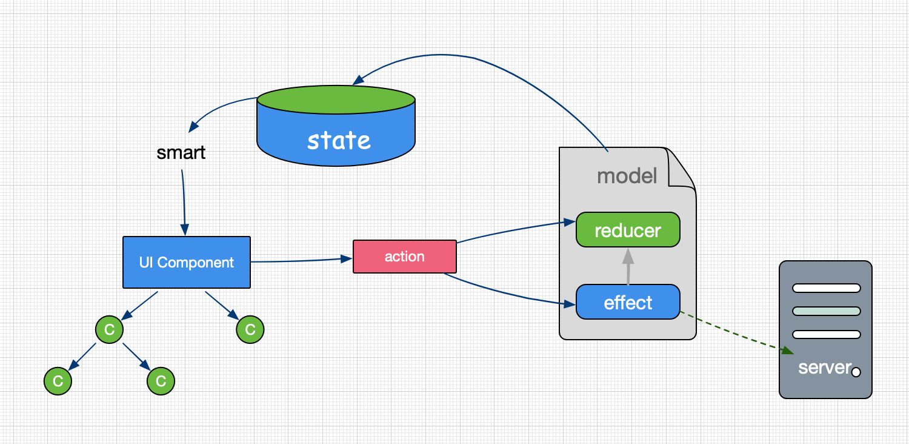

# @gem-mine/durex 使用文档

## 概述

@gem-mine/durex 作为 gem-mine 生态圈中 为 react 提供 redux 工具，为项目在数据流管理使用上提供极大的便利。

redux 在提供数据流管理的同时，也带来诸多概念：action、reducer、middleware、dispatch、action type、constant 等等，在写法上也非常繁复，通常为了写一个小小的事件，在多个目录之间切换，存在太多的重复性代码。

@gem-mine/durex 在吸收社区在 redux 各种封装方案，包括了 mirror、dva、kea 等，尤其是 mirror，在代码层面提供了根本性的参考。

如果你有 redux 基础，那么阅读此文档，在概念上你不会有太多的障碍。如果你还不了解 redux，也不妨碍你学习试用 @gem-mine/durex。当然，还是希望你能够先大致了解一下 redux 是什么，带来了什么。可以阅读这个 [redux 中文文档](https://www.redux.org.cn/) 进行快速了解其动机、核心概念、reducer、action 等内容。

@gem-mine/durex 主要是通过 model 概念进行数据流管理，然后通过 actions 进行调用。主要概念包括了：

- model：声明一个对象，包括：
  - name：命名空间
  - state：初始数据
  - reducers：同步 reducer 集合
  - effects：异步 reducer 集合

  会组织创建好 reducer、action，并被注入到 redux store 中
- smart：将 store 和 组件进行绑定，一个更方便的 redux connect
- actions：通过命名空间上挂载的方法，调用后会执行 reducers 或 effects

通过这三个概念基本就可以方便的使用数据流管理了，当然，@gem-mine/durex 中还有一些高级的用法，在后面文档中会有说明。我们可以看下基本流程图：



## 快速起步

> gem-mine 提供了脚手架，已经内置了 @gem-mine/durex 数据流管理以及其他常用的最佳实践。这里的快速起步目的在于为一般项目中集成 @gem-mine/durex 提供参考意义

下面我们在 create-react-app 中示范如何使用。

使用 create-react-app 创建一个项目：
```shell
create-react-app demo
```

安装 @gem-mine/durex
```shell
npm i @gem-mine/durex -S
```

然后，我们声明一个 model(我们准备做一个经典的递增计数器)。在 src 目录下创建一个 model.js
```js
import durex from '@gem-mine/durex'

durex.model({
  name: 'demo',
  state: {
    count: 1
  },
  reducers: {
    increase() {
      return this.setField({
        count: prev => prev + 1
      })
    }
  }
})
```

接着，我们要引入这个 model.js，需要做两步：
- 加载 model
- 使用 @gem-mine/durex 的 render，这样才会创建 store

这两步都在 index.js 中编辑：
```js
import React from 'react'
import { render } from '@gem-mine/durex'
import './index.css'
import App from './App'
import * as serviceWorker from './serviceWorker'
import './model'

render(<App />, document.getElementById('root'))

// If you want your app to work offline and load faster, you can change
// unregister() to register() below. Note this comes with some pitfalls.
// Learn more about service workers: https://bit.ly/CRA-PWA
serviceWorker.unregister()
```

这里的改变是：
- 第 2 行：将原来的 ReactDom 改成了引入@gem-mine/durex 的 render
- 第 6 行：引入 model
- 第 8 行：将 ReactDom.render 改成了 render

附修改前的代码：
```js
import React from 'react'
import ReactDOM from 'react-dom'
import './index.css'
import App from './App'
import * as serviceWorker from './serviceWorker'

ReactDOM.render(<App />, document.getElementById('root'))

// If you want your app to work offline and load faster, you can change
// unregister() to register() below. Note this comes with some pitfalls.
// Learn more about service workers: https://bit.ly/CRA-PWA
serviceWorker.unregister()
```

最后我们开始使用，我们来修改 App.js 文件。这里做几个改变：
- 引入 @gem-mine/durex 的 smart、actions，因为要使用数据流的数据，同时要触发 action
- 使用 smart 连接组件和 store
- 在组件中添加一个显示数字以及一个触发的按钮，该按钮点击后调用 action

修改后的代码：
```js
import React from 'react'
import logo from './logo.svg'
import './App.css'
import { actions, smart } from '@gem-mine/durex'

function App(props) {
  return (
    <div className="App">
      <header className="App-header">
        
        <p>
          <span>{props.count}</span>
          <button onClick={() => actions.demo.increase()}>increase</button>
        </p>
        <a className="App-link" href="https://reactjs.org" target="_blank" rel="noopener noreferrer">
          Learn React
        </a>
      </header>
    </div>
  )
}

export default smart(state => {
  return {
    count: state.demo.count
  }
})(App)
```

附修改前的代码：
```js
import React from 'react'
import logo from './logo.svg'
import './App.css'

function App() {
  return (
    <div className="App">
      <header className="App-header">
        
        <p>
          Edit <code>src/App.js</code> and save to reload.
        </p>
        <a className="App-link" href="https://reactjs.org" target="_blank" rel="noopener noreferrer">
          Learn React
        </a>
      </header>
    </div>
  )
}

export default App
```

从上面这个例子我们可以看出，通过 @gem-mine/durex 引入数据流管理方案的成本是很小的，只修改了几行代码就可以给项目迅速带来 redux 的数据流管理能力。如果你有自己的脚手架，不妨快速引入试一试。当然，我还是推荐使用 gem-mine 提供的专业脚手架。

## API 说明

### model 声明
先看下一个基本的 model 声明：
```js
import durex from '@gem-mine/durex'
durex.model({
  name: 'demo',
  state: {
    count: 1
  },
  reducers: {
    increase() {
      return this.setField({
        count: prev => prev + 1
      })
    }
  }，
  effects: {
    async fetch() {
      // await something
    }
  }
})
```

model 声明了一个数据流，包括了：
- 数据流的命名空间：name，必须。
  name 是 model 的名称，用于创建命名空间，该命名空间起到了两个作用：
  - 将模块自己的 state 挂载到此命名空间下，在连接组件时(smart) 通过此名字来获取对应的数据
  - 将模块自己的 actions 挂载到此命名空间下，在调用 actions 时通过此名字来获取对应的 reducers 或 effects
- 初始化数据：state，可选。
  state 是 redux reducer 中标准的 initialState
- reducers：同步方式的 reducer，可选。
  reducers 由一个个 function 组成的键值对，@gem-mine/durex 会对这些函数进行：
  - 创建 redux 中的 reducer
  - 自动根据[model name + reducer name] 来创建 action，因此一个 reducer 对应的是一个 action
  - 将 action 挂载在 actions[model name] 下，通过 reducer name 来访问

  reducers 中的 function(称之为 reducer) 有几点注意点：
  - reducer 请勿使用箭头函数方式。因为如果内部有注入两个便捷的函数，挂载在 this 上，使用箭头函数将使得 this 丢失。这两个函数是：
    - this.getState()：获取当前 model 的 state，通常用于访问某些 state 属性
    - this.setField(data)：这是一个高频使用的方法，可以快速设置当前 model 的 state。这个方法使用了 immutable 能力。使用方式实例：
      - this.setField({ count: 2}) 将 state.count 值设置为 2
      - this.setField({ count: prev => prev + 1}) 这里 count 的值是一个函数，它将会被执行，并且这个函数的参数是当前 state 中对应的值，这样可以很方便进行一些根据当前值进行的操作

      关于 setField 后续还会介绍，因为使用中还可以通过 actions[model name].setField 进行使用。

  - 创建的 reducer 是纯的 redux 的 reducer，redux 要求每个 reducer 必须返回一个 state，因此这里的 function 必须要 return 一个 state

  - reducer 中无法获取到其他 model 的数据，这一点是被 redux 4.x 限制。如果需要获取其他 model，可以使用：
    - 在调用 reducer 时传入
    - 使用 effects

- effects：异步方式的 reducer，可选。
  effects 使用上和 reducers 基本是一样的，它也是由一个个 function 组成的键值对。它也同样会创建 reducer、action 并挂载到对应 model 上。effects 和 reducers 的差异点在于：
  - effect 是异步的，它不要求有返回值。当然，如果你提供了返回值，你可以通过 promise 的 then 来获取，当然也可以通过 async/await 来获取。因为 effect 内部返回了一个 promise
  - effect 中除了可以使用 this.getState，this.setField 之外，还可以获取到全局的 store，进而可以获取到其他的 model 数据。使用方式是通过 effects 中 定义的函数的第二个参数获取：
    ```js
    effects: {
      async fetch(data, getState) {
        // const state = this.getState() // 获取当前 model 的 state
        // const store = getState() // 获取到全局的 store
      }
    }
    ```

在业务上，大部分操作都是异步或者有副作用的，因此 effects 相对于 reducers 来说更常用。加上 actions[model name].setField 的提供，定义 reducers 的情况很少。

另外，需要注意的是，reducers 和 effects 中不能出现重复的 key，因为它们会统一注入到 actions 中。

声明好 model 后，一般在应用的入口处进行引用，只要简单的进行 import 或者 require 对应的 model 文件即可。

### smart 连接
声明引用好 model 后，在 UI 组件中使用，就需要连接。在 redux 中叫做 connect（由 react-redux 提供），@gem-mine/durex 提供了一个易用版本：smart。

来看看 smart 的简单使用：
```js
import { smart } from '@gem-mine/durex'

@smart(state => {
  return {
    count: state.demo.count
  }
})
class SomeComponent extends React.Component {
  render() {
    // 从 props 中可以拿到 smart 注入的 count 属性了
    const { count } = this.props
    return <div>{count}</div>
  }
}
```

这里使用了 decorator，项目中需要进行 babel 配置才能使用(使用插件 @babel/plugin-proposal-decorators)。如果你没有配置，可以使用高阶函数形式调用：
```js
smart(state => {
  return {
    count: state.demo.count
  }
})(SomeComponent)
```

smart 函数的定义如下：

```js
smart(mapStateToProps: function(state, ownProps), mapDispatchToProps ?: function())
```

也就是说，smart 接受两个函数作为参数：
- mapStateToProps(state, ownProps)：用来从 store 上获取到数据注入到组件。其中 state 是全局 store，你可以从中获取部分属性，然后将这些数据 return。而 ownProps 比较少用，是注入一些非 store 上的数据
- mapDispatchToProps(stateProps, dispatchProps, ownProps)：用来创建一些方法注入到组件中，这个参数是可选的，也比较少被使用。

### actions 调用
在 model 中定义好 reducers、effects 后，这些方法就会挂载在 actions 下。

actions 是一个简单易用强大的功能，通过它你不再需要将定义的 reducers 通过 connect map 到组件中。
- 调用 model 中声明的 reducers、effects
  model 中声明好了 reducers、effects，将会统一注入到 actions 中，对于使用者来说，只要关注 actions 即可。

  ```js
  import { actions } from '@gem-mine/durex'

  // 在某些事件中调用
  actions[model name].someReducer(data)
  ```

- 内置 action：setField
  每一个 model 中都会注入 setField 方法，用于简化 reducers 编写。

  如果只是要将某个 model 中的 state 进行简单修改，完全可以使用 setField 方法：
  ```js
  import { actions } from '@gem-mine/durex'

  // 在某些事件中调用
  actions.demo.setField({
    count: prev => prev + 1
  })
  ```

- 内置 action：resetState

  在某些情况下，你可能需要将某个 model 的数据进行重置，恢复到初始状态，那么就可以使用这个方法：

  ```js
  import { actions } from '@gem-mine/durex'

  // 在某些事件中调用
  actions.demo.resetField()
  ```

### render 渲染
render 是 ReactDOM.render 的增强版本，它会创建 redux store，并将组件渲染到对应的容器当中。

```js
import { render } from '@gem-mine/durex'

render(<App />, document.getElementById('root'))
```

render 函数声明为：

```js
render([Component], [container], [callback])
```

一般在应用入口处调用 render，而在 render 之前请引入定义好的 model。

在少数应用场景中，希望 model 是动态引用的，这时候可以在 model 动态引入后，重新调用 render 方法，不用传递参数。但动态引用 model 的情况需要开发者非常清楚整个应用的数据流过程如何触发，不是非常推荐使用，它可能导致某个组件触发某个 model 时对应的 model 还没有加载的异常。

### defaults 配置

设置 @gem-mine/durex 的全局配置，一般情况下你并不需要配置。

```js
import durex from '@gem-mine/durex'

durex.defaults({
  // 路由模式，默认 hash，可选 browser，采用 history 模式，需要服务端支持
  // 该参数需要引入 @gem-mine/durex-router 插件后才会生效
  historyMode: 'hash',
  // 额外定义的 reducer，很少使用
  reducers: {},
  // 额外添加的中间件，很少使用
  middlewares: []
})
```

一般使用到 defaults 的情况是你需要修改路由模式，此时需要先安装 @gem-mine/durex-router，具体使用请参考 @gem-mine/durex-router 文档。

### getState 获取全局 store

getState 用来获取全局的 store，从而获取到其他 model 的信息。 getState 通常存在于两个地方：

- 直接调用：

  ```js
  import { getState } from '@gem-mine/durex'

  const store = getState()
  ```

- 通过 effects 定义的函数的第二个参数使用：

  ```js
  import durex from '@gem-mine/durex'

  durex.model({
    name: 'demo',
    effects: {
      async someEffect(data, getState) {
        const store = getState()
      }
    }
  })
  ```

在 reducers 或 effects 中，可以通过 this.getState() 来获取当前 model 的 state，前面已经说明不在赘述。

在后续高级用法 hook 中也会看到 getState 的使用

### addReducer/addMiddleware 中间件

这两个方法一般在给 @gem-mine/durex 写插件时使用。例如 @gem-mine/durex-router 就是通过这两个方法来给项目添加 路由能力，并将路由结合到 redux 中。

```js
import { addReducer, addMiddleware } from '@gem-mine/durex'

// 添加 reducer
addReducer({
  demo: {
    fn() {}
    // ....
  }
})

// 添加 middleware，参数是标准的 redux middleware
addMiddleware(someMiddleware)
```

关于 middleware 的相关知识，可以参考以下文章：

- https://www.redux.org.cn/docs/advanced/Middleware.html
- https://zhuanlan.zhihu.com/p/21391101

### hook 监控

hook 作用于所有的 action，因此通常用于 action 的通用处理。

```
import durex from '@gem-mine/durex'

// getState 能够获取到全局 store
durex.hook((action, getState) => {
  // 针对 xxx 的 action 进行通用处理
  if (action.type === 'xxx') {

  }
})
```

例如在路由切换时需要进行某些菜单的高亮操作，使用 hook 是一个很好的方式。

## 周边

### @gem-mine/durex-router

作为 @gem-mine/durex 的插件，为项目提供路由能力。文档参见：[@gem-mine/durex-router 文档](https://github.com/gem-mine/durex-router)

### @gem-mine/immutable

被 @gem-mine/durex 内部使用，为 setField 提供支持。文档参见：[@gem-mine/immutable 文档](https://github.com/gem-mine/immutable)

### @gem-mine/request

通常在 @gem-mine/durex 编写 model 的 effects 中作为 ajax 请求库出现。文档参见：[@gem-mine/request 文档](https://github.com/gem-mine/request)

## 最佳实践

### 默认加载所有声明的 model

一般我们会在应用的入口处加载项目中所有的 model，这样可以减轻后续手动加载的麻烦。

我们可以通过 webpack 提供的 require.context 进行对应文件的加载，因此我们需要给 model 命名设定一个规范：位于 src 目录下所有叫 model.js 的文件 以及所有位于 model 目录下的 .js 文件都视为 model 被加载

```js
function importAll(modules) {
  if (modules) {
    modules.keys().forEach(key => {
      modules(key)
    })
  }
}

importAll(require.context('../src', true, /model(\/.+)?\.js$/))
```

## 常见问题

### 如何在 reducers、effects 中获取全局 store？

reducers 中不能获取到全局的 store，可以在调用 action 时将需要的数据作为参数传入。

effects 中可以通过第二个参数 getState 进行获取。

对于在其他地方中，可以通过 @gem-mine/durex 提供的 getState 方法进行获取。

### 如何在 reducers、effects 中获取当前 model 的 state？

通过 this.getState() 获取

### 如果在 reducers、effects 中调用其他 action？

这里的其他 action 分为两种情况：

- 调用自身 model 的 其他 action，可以通过 this.action.xxx 进行
- 调用其他 model 的 action，可以通过 actions[model name].xxx 进行

建议一个 action 做一件相对纯粹的事情，而 action 的组合通常可以在外部组件使用时进行。

### 如何选择使用 reducers 还是 effects？

首先，reducers 存在感很低，大概率情况下不会存在。即便存在，也大部分会被 setField 这个方法通用取代。

在处理异步或者其他有副作用时请采用 effects，因此项目中的网络请求都放在 effects 中。

二者的区别在上述 [API 说明- model 声明] 有详细阐述。

### 如何选择使用 model 还是组件本身的 state？

这其实是说如何选择某个状态保存在 redux 中，还是组件的 state 中。

通常情况下，我倾向于不使用数据流管理，而使用 react 本身提供的 state 功能。在满足以下条件之一时，可以考虑使用数据流管理：

- 你希望某个状态被缓存，在页面被切换时也应该保留
- 组件之间通信太过复杂，例如跨层级、兄弟组件之间。但这一点会被 react 提供的 hooks 缓解。如果只是单个父子组件之间通信，可以考虑使用在 父组件定义 state，并将其传递给子组件

## 版本历史

最初的 @gem-mine/durex 叫 cat-eye，基本上是一个 mirror 的定制版，并增加了配置型路由、请求库，使用了 immutable(即现在的 @gem-mine/immutable)，并增加了一些常用的 API。

而后逐步依据职责单一原则将能力拆分：

- @gem-mine/durex：纯粹负责 react + redux 的数据流能力
- @gem-mine/durex-router：负责 react-router 路由相关能力，并提供配置型路由、路径解析能力
- @gem-mine/request：负责提供前端 ajax 请求能力，基于 axios 的封装
- @gem-mine/immutable 提供 javascript 的 immutable 能力

@gem-mine/durex 1.x 版本还未将路由剥离，2.x 版本将路由剥离到了 @gem-mine/durex-router，在需要路由的项目直接 import @gem-mine/durex-router 后即可使用。这里的版本历史从 2.x 版本开始：

- 2.0.5：clean：清理发布到 npm 的无用文件
- 2.0.4：enhance：为每个 model 内置 resetState action，用于快速重置对应 model 的 state
- 2.0.3：fixbug：middleware 在 defaults 之前注册导致被覆盖的问题
- 2.0.2：depricate：此版本废弃，添加的 dispatch API 后续被废弃
- 2.0.1：enhance：添加 addMiddleware & addReducer API
- 2.0.0：发布 @gem-mine/durex 纯粹数据流版本，剥离路由能力到 @gem-mine/durex-router

## 后续计划

- 添加单元测试用例
- 添加 typescript 支持
- 考虑剥离 react 依赖，或者提供一个 durex-core 来作为无 react 依赖版本，这样可以运行在 非 react 环境下(例如小程序环境)
